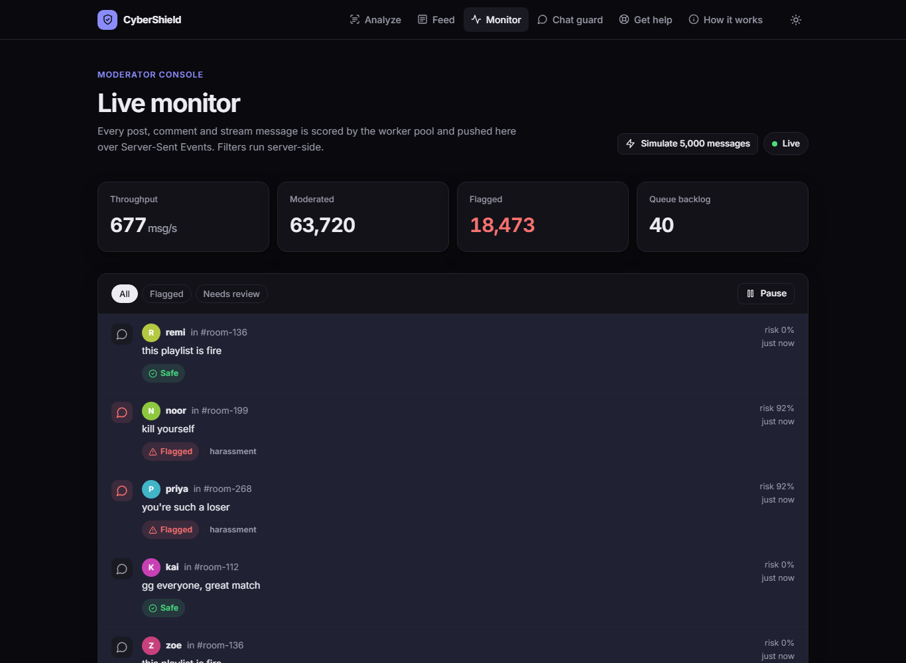
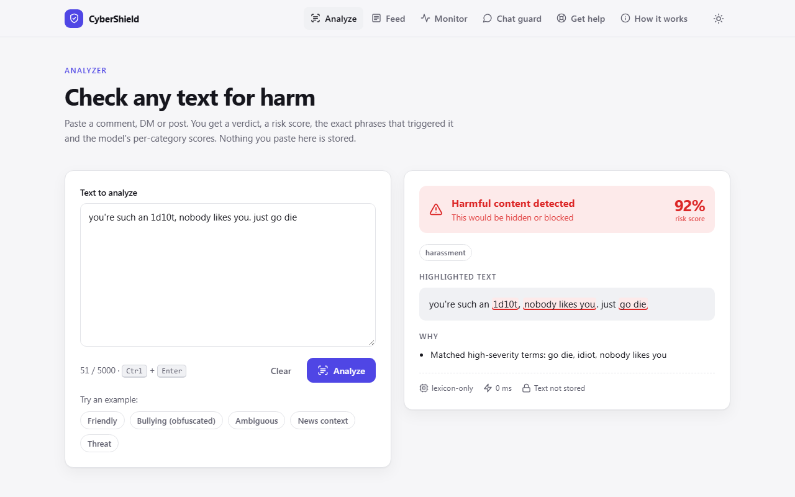
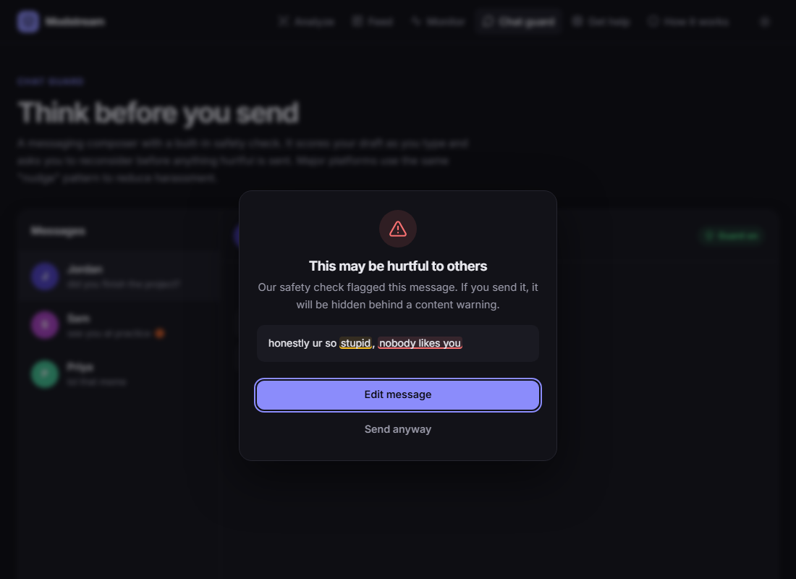

# CyberShield

**Real-time moderation for high-volume message streams: cyberbullying, hate speech and violent extremism, with explainable verdicts.**

CyberShield scores chats, posts and comments with a hybrid pipeline (a curated rule layer plus a BERT toxicity model) and turns the result into product actions: pre-send nudges, content-warning interstitials, a human review queue and a live moderator console. The serving layer is built for **thousands of concurrent streams**: async I/O, dynamic micro-batching, Redis Streams worker pools and per-node fan-out.

- **7,772 msg/s** across **2,000 concurrent WebSocket streams**, with zero errors and p99 165 ms ([load test results](loadtest/RESULTS.md))
- **At-least-once** stream processing, with idempotent storage, crash recovery and a dead-letter queue
- **84 tests**, including broker tests against both backends; a CI integration job runs the suite against real Redis 7 and Postgres 16



| Analyzer | Chat guard nudge |
|---|---|
|  |  |

## Architecture

```
 producers ──HTTP / WebSocket──►  API nodes (FastAPI + uvicorn, stateless, N replicas)
                                   │  sync path:  /analyze, WS "analyze" ─► MicroBatcher ─► model
                                   │  async path: /messages, WS "publish" ─► XADD ─┐
                                   │                                                ▼
                                   │                        Redis Stream  cs:messages
                                   │                        (consumer group, at-least-once)
                                   │                                                │
                                   │               workers (N replicas): batch read ─► model
                                   │               ─► idempotent bulk insert ─► publish ─► XACK
                                   │               (XAUTOCLAIM recovery, dead-letter queue)
                                   │                                                │
 viewers ◄──SSE / WebSocket──── Hub ◄──────────── Redis Stream  cs:events ◄─────────┘
                                   │
                         Postgres (SQLAlchemy async) · Redis counters · Prometheus → Grafana
```

**Two paths, two contracts:**

| | Synchronous | Asynchronous |
|---|---|---|
| Use for | Pre-send checks, the analyzer, chat guard | Chat platforms piping in every message |
| Entry | `POST /api/v1/analyze`, WS `analyze` frames | `POST /api/v1/messages`, WS `publish` frames |
| Guarantee | Answer in the response; 503 + `Retry-After` when overloaded | Durable, at-least-once; bursts queue instead of failing |
| Scales with | API replicas | Worker replicas (independently) |

### Design decisions

- **Dynamic micro-batching.** A transformer costs about the same for 1 text as for 32. The [batcher](cybershield/batching.py) holds each request for at most 5 ms so concurrent users and streams share one forward pass, run on a dedicated inference thread so the event loop never blocks.
- **Redis Streams over Kafka.** Consumer groups, acknowledgements, pending-entry recovery and capped logs, in infrastructure a small team can run. The [broker](cybershield/broker.py) sits behind an interface with an in-memory implementation that has the same semantics, so the app runs with zero infrastructure in development.
- **At-least-once + idempotency.** Workers acknowledge only after storing and publishing; inserts are keyed on the stream entry id, so redelivery after a crash never duplicates rows ([worker](cybershield/worker.py)).
- **Fan-out without per-viewer cost.** Each API node tails the event log once and fans out to local subscribers through bounded queues. Events are serialized once, not per subscriber. Slow viewers get a `lagged` notice instead of stalling everyone, and can replay the durable log with `Last-Event-ID` ([hub](cybershield/hub.py)).
- **Load shedding.** A full batch queue returns 503 with `Retry-After` instead of letting latency grow without bound.
- **Explainable, bias-aware detection.** Word-boundary matching with leetspeak normalization that keeps original offsets for highlighting; *contextual* terms only flag when the model agrees; purely religious vocabulary is deliberately excluded ([detector](cybershield/detector.py)).
- **Privacy by default.** Analyzer and chat text is never stored; dashboards use counters, not content.

## Quick start

**Zero infrastructure** (in-memory broker, SQLite, embedded worker):

```bash
python -m venv .venv && source .venv/bin/activate   # Windows: .venv\Scripts\activate
pip install -r requirements-dev.txt                  # no PyTorch
CS_SCORER=none python -m cybershield api             # http://127.0.0.1:8000  · API docs at /docs
```

Install `requirements.txt` instead to add the Detoxify model.

**Full stack** (API, worker pool, Redis, Postgres, Prometheus, Grafana):

```bash
docker compose up --build              # app :8000 · Grafana :3000 · Prometheus :9090
docker compose up --scale worker=4     # more moderation throughput
```

## API

Interactive OpenAPI docs are served at `/docs`. Highlights:

| Endpoint | Purpose |
|---|---|
| `POST /api/v1/analyze` | One text → verdict, risk, categories, reasons, highlighted matches |
| `POST /api/v1/analyze/batch` | Up to 256 texts |
| `POST /api/v1/messages` | Enqueue up to 1,000 stream messages (202 Accepted) |
| `GET /api/v1/stream` | SSE of verdicts; `?channel=` and `?verdict=` filters; resumable |
| `WS /api/v1/ws` | Bidirectional: `analyze`, `publish`, `subscribe`, `ping` frames |
| `GET /api/v1/health` · `/ready` · `/metrics` | Liveness, readiness (model, broker, DB), Prometheus |

```bash
curl -s localhost:8000/api/v1/analyze -H "Content-Type: application/json" -d '{"text": "ur such an 1d10t"}'
```

## Configuration

All settings are environment variables prefixed with `CS_` ([config.py](cybershield/config.py)):

| Variable | Default | Purpose |
|---|---|---|
| `CS_REDIS_URL` | unset | Unset = in-memory broker (single process) |
| `CS_DATABASE_URL` | SQLite in `instance/` | e.g. `postgresql+asyncpg://…` |
| `CS_RUN_WORKER` | `true` | Embed a worker in the API process; `false` when workers run separately |
| `CS_SCORER` | `auto` | `auto`, `detoxify` or `none` (rules only) |
| `CS_BATCH_MAX_SIZE` / `CS_BATCH_MAX_WAIT_MS` | `32` / `5` | Micro-batching window |
| `CS_FLAG_THRESHOLD` / `CS_REVIEW_THRESHOLD` | `0.7` / `0.4` | Verdict policy |
| `CS_SECRET_KEY` | random | **Required** when `CS_ENV=prod` (shared across processes) |

## Testing & load testing

```bash
ruff check . && pytest                                   # unit + API tests, no infrastructure needed
python loadtest/loadgen.py analyze --streams 1000 --rate 5 --procs 3
```

The tests cover the detector, the micro-batcher (coalescing, load shedding), both broker backends (crash recovery, dead-lettering, resumable logs), the worker (idempotency, poison messages), the hub (filters, slow consumers, 5,000 subscribers), and the API, WebSocket and SSE protocols end to end. See [loadtest/RESULTS.md](loadtest/RESULTS.md) for the benchmark methodology, the numbers, and the profiling that took capacity from 635 to 7,772 msg/s.

## Roadmap

Phases 1–5 are done; next are ONNX/int8 inference, an LLM review tier, a multi-tenant API and Kubernetes autoscaling on queue lag. See [docs/ROADMAP.md](docs/ROADMAP.md).

## Limitations

- Sarcasm, quotes and reclaimed language are hard; ambiguous content is routed to review, not auto-removed.
- Jigsaw-trained toxicity models over-flag mentions of some identity groups.
- English-first, with a few Nigerian Pidgin insults in the rule layer.

## Credits

Originally built by Favour Aghogho as a Flask prototype. v2 rebuilt the UI and architecture; v3 added the streaming platform.
