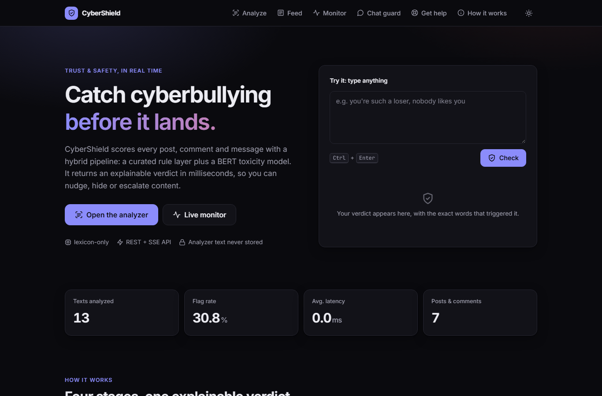
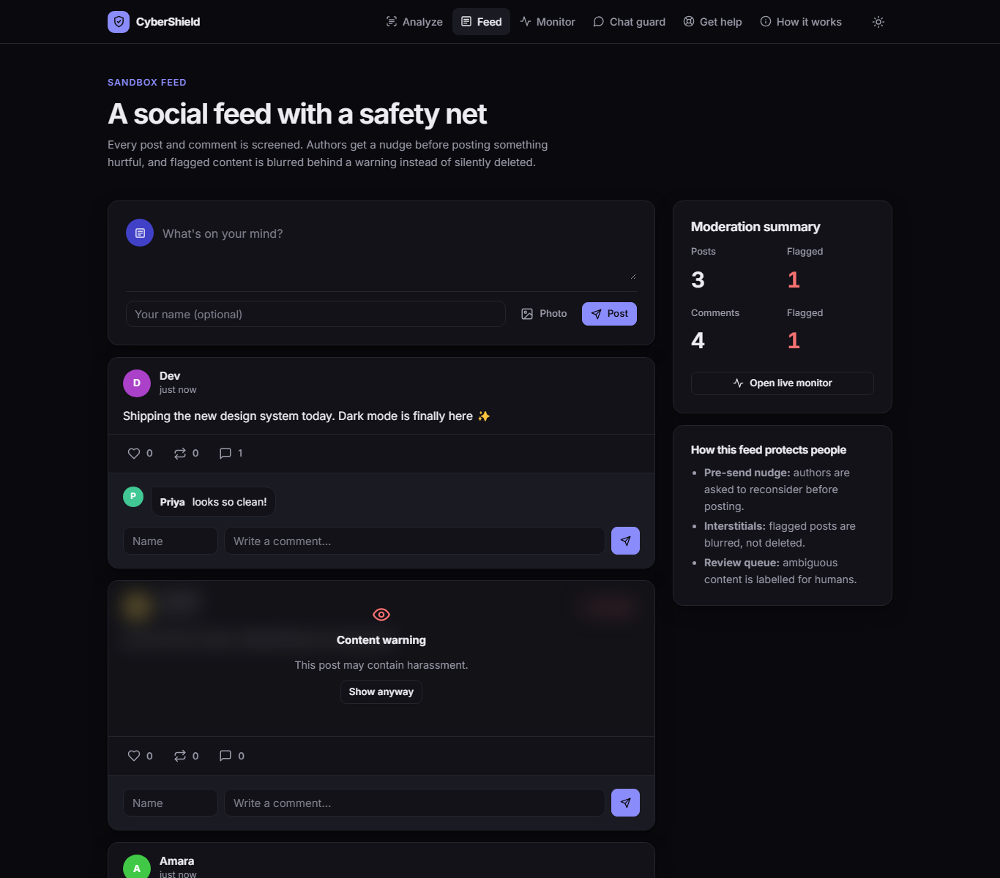

# CyberShield

**Real-time detection of cyberbullying, hate speech and violent extremism, with explainable verdicts.**

CyberShield scores posts, comments and messages with a hybrid pipeline (a curated rule layer plus a BERT toxicity model) and turns the result into product actions: pre-send nudges, content-warning interstitials, a human review queue and a live moderator console.



| Analyzer | Chat guard nudge |
|---|---|
|  |  |

| Sandbox feed | Live monitor |
|---|---|
|  |  |

## Features

- **Analyzer**: a verdict, a 0–1 risk score, per-category model scores and the exact phrases that triggered it, highlighted in the original text.
- **Sandbox social feed**: authors are nudged before posting something hurtful. Flagged posts are blurred behind a content warning instead of being silently deleted.
- **Chat guard**: scores your draft as you type (debounced) and asks "are you sure?" before sending.
- **Live monitor**: a moderator console fed by Server-Sent Events, with filters, pause/resume and live counters.
- **Versioned REST API** with batch scoring, a consistent error format and a health endpoint.
- **Responsive, accessible UI** with light/dark themes. It works without JavaScript and is progressively enhanced with ES modules.

## Architecture

```
Browser (Jinja + ES modules)
   │  HTML forms            │  fetch /api/v1/*        │  EventSource /api/v1/stream
   ▼                        ▼                         ▼
┌────────── Flask app factory ───────────────────────────────────────────┐
│  pages blueprint        api blueprint                                  │
│        └──────────┬─────────┘                                          │
│               services  (validation, upload sniffing, use cases)       │
│                   │                                                    │
│   Detector ── normalize → lexicon (tiered) → Scorer (Detoxify) → policy│
│                   │            LRU cache, batch inference, lazy warm-up │
│   SQLite (WAL) ── posts · comments · scans (metadata only) · events    │
└────────────────────────────────────────────────────────────────────────┘
```

| Path | Responsibility |
|---|---|
| [cybershield/detector.py](cybershield/detector.py) | Normalization, word-boundary matching, the pluggable `Scorer` protocol and the verdict policy |
| [cybershield/lexicon.py](cybershield/lexicon.py) | Curated term lists, split into *strong* and *contextual* tiers |
| [cybershield/services.py](cybershield/services.py) | Use cases shared by pages and the API |
| [cybershield/db.py](cybershield/db.py) | SQLite schema, queries and the event outbox behind the live stream |
| [cybershield/api.py](cybershield/api.py) | `/api/v1` JSON API + SSE |
| [cybershield/pages.py](cybershield/pages.py) | Server-rendered pages; legacy URLs redirect |

### Design decisions

- **Hybrid detection.** The rules are fast, precise and explainable; the model catches what the rules miss. *Contextual* terms ("stupid", "bomb", extremist group names) only escalate to a flag when the model agrees. On their own they go to human review, which cuts false positives like "heart attack" or news coverage.
- **Evasion-resistant without losing explainability.** Leetspeak (`1d10t`, `$tup1d`) is normalized with a 1:1 character map, so match offsets still point at the original text for highlighting.
- **Bias-aware lexicon.** Purely religious vocabulary is deliberately excluded. Flagging it penalizes ordinary speech and is a known failure mode of moderation systems.
- **Transactional outbox for streaming.** Every write appends to an `events` table. The SSE endpoint streams by id, so clients resume with `Last-Event-ID` and the stream works across workers. Connections are recycled after 5 minutes so worker threads are never held forever.
- **Privacy by default.** Analyzer and chat text is never stored; only verdict metadata is logged for stats.
- **Testable ML.** The model sits behind a `Scorer` protocol. Tests inject a deterministic fake, so CI runs in seconds without PyTorch.

## API

| Method | Endpoint | Description |
|---|---|---|
| POST | `/api/v1/analyze` | `{"text": "..."}` → verdict, risk, categories, reasons, matches, model scores |
| POST | `/api/v1/analyze/batch` | Up to 32 texts in one model forward pass |
| GET/POST | `/api/v1/posts` | List posts / create a post (JSON or multipart with image) |
| POST | `/api/v1/posts/:id/comments` | Add a comment |
| POST | `/api/v1/posts/:id/reactions` | `{"kind": "like" \| "share"}` |
| GET | `/api/v1/stream` | Server-Sent Events of new posts and comments (resumable) |
| GET | `/api/v1/stats` | Aggregate counts, flag rate, latency, categories |
| GET | `/api/v1/health` | Liveness, version and model readiness |

```bash
curl -s localhost:5000/api/v1/analyze -H "Content-Type: application/json" \
  -d '{"text": "ur such an 1d10t"}'
```

## Running locally

**Docker (full ML stack, model weights baked into the image):**

```bash
docker compose up --build        # http://localhost:8000
```

**Python 3.10+:**

```bash
python -m venv .venv
source .venv/bin/activate        # Windows: .venv\Scripts\activate
pip install -r requirements.txt  # includes PyTorch + Detoxify
python app.py                    # http://127.0.0.1:5000
```

**Lightweight mode (rules only, no PyTorch download):**

```bash
pip install -r requirements-dev.txt
CYBERSHIELD_SCORER=none python app.py
```

### Configuration

| Variable | Default | Purpose |
|---|---|---|
| `CYBERSHIELD_SCORER` | `auto` | `auto`, `detoxify` or `none` (rules only) |
| `FLAG_THRESHOLD` / `REVIEW_THRESHOLD` | `0.7` / `0.4` | Model score cut-offs for the verdict policy |
| `DATABASE_PATH` | `instance/cybershield.db` | SQLite file |
| `UPLOAD_FOLDER` | `instance/uploads` | Uploaded images (validated by magic bytes, renamed) |
| `SECRET_KEY` | random | Flask session signing |

## Tests & quality

```bash
pip install -r requirements-dev.txt
ruff check .
pytest
```

The 46 tests cover the detector (boundaries, leetspeak, overlap resolution, policy tiers, caching, batching), the API (validation, error shapes, upload sniffing, SSE replay and resume) and the pages (rendering, XSS escaping, legacy redirects, security headers). GitHub Actions runs lint and tests on Python 3.10 and 3.12, then builds the Docker image.

## Limitations

- Sarcasm, quotes and reclaimed language remain hard; that's why ambiguous content is routed to review rather than auto-removed.
- Toxicity models trained on Jigsaw data are known to over-flag mentions of some identity groups.
- English-first, with a few Nigerian Pidgin insults in the rule layer.

## Credits

Originally built by Favour Aghogho as a Flask prototype; v2 is a full rebuild of the architecture and UI.
